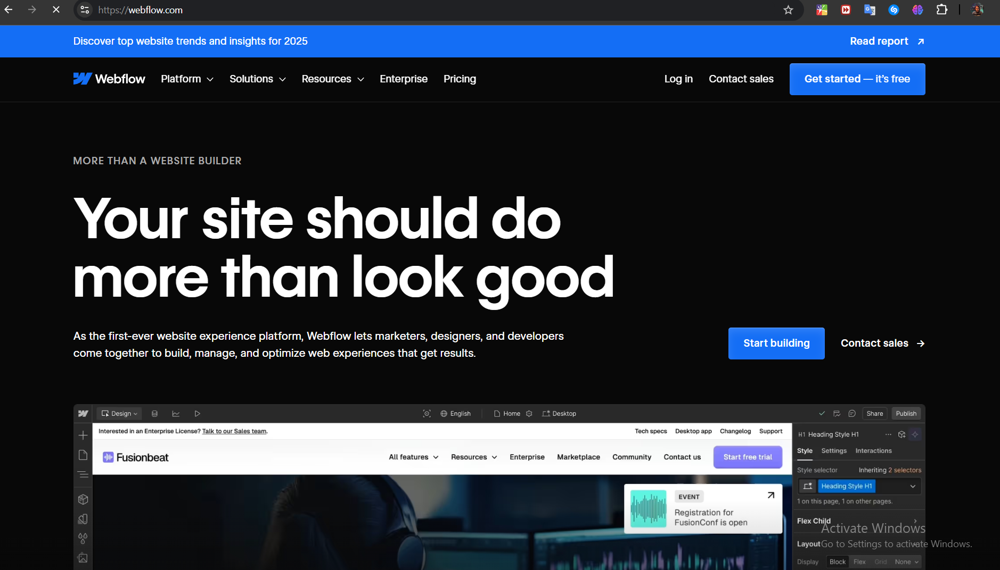
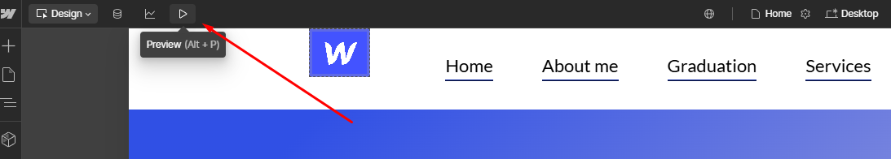
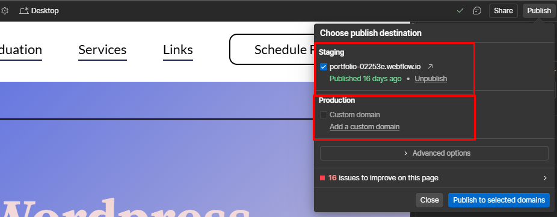

# Napredni-SWE
__Repozitorijum koji ce se koristiti za kacenje materijala koji je potreban za polaganje predmeta napredni SWE__

## Tutorijal za _Webflow_: Razvoj interaktivnih _web_ sajtova bez kodiranja  

## **1. O samom readme.md fajlu**

Fajl služi kao tutorijal za korišćenje Webflow-a. Glavni cilj je da se:  
- Ukaže na prednosti ovog moćnog alata.  
- Prikaže kako se _Webflow_ koristi za kreiranje interaktivnih i responzivnih *web*-sajtova.  
- Objasni struktura i način rada sa *Webflow-om* (od instalacija do _publish_-ovanja Vaseg prvog _web_ sajta)

## **2. Šta je Webflow?**

**Webflow** je platforma za vizuelni dizajn i razvoj veb-sajtova koja omogućava korisnicima da kreiraju, dizajniraju, i objavljuju veb sajtove bez potrebe za pisanjem koda. Platforma automatski generiše visokokvalitetan HTML, CSS, i JavaScript kod u pozadini, omogućavajući dizajnerima i programerima da se fokusiraju na kreativne aspekte projekta. Webflow se koristi za kreiranje responzivnih sajtova, e-commerce rešenja, i složenih interakcija i animacija.

### **Istorija Webflow-a**

Webflow je osnovan 2013. godine u San Francisku od strane **Viktora Kjua** i **Peta Loksa**. Ideja za Webflow proizašla je iz potrebe za alatkom koja bi omogućila dizajnerima da stvaraju profesionalne veb sajtove bez potrebe za angažovanjem programera ili učenjem koda. Osnivači su želeli da reše problem u industriji veb dizajna, gde su dizajneri morali da koriste složene alate ili rade u saradnji sa developerima kako bi implementirali njihove dizajnerske ideje.

Kroz prve godine razvoja, Webflow je odjednom postao popularan zbog svoje jedinstvene kombinacije dizajnerskog interfejsa i sposobnosti generisanja čistog koda. Platforma je omogućila profesionalnim dizajnerima da sami kontrolišu kako će sajt izgledati i funkcionisati, a istovremeno su imali pristup tehničkoj strani veb sajtova bez potrebe da budu stručnjaci za kodiranje.

### **Kako je nastao?**
___
Platforma je započela kao alat za dizajn i generisanje HTML koda, ali je brzo evoluirala u sveobuhvatan alat koji uključuje i CMS (sistem za upravljanje sadržajem), hosting, i mogućnosti za kreiranje složenih animacija i interaktivnih efekata. Webflow je brzo postao popularan među dizajnerima zbog svoje fleksibilnosti, vizuelnog pristupa razvoju i činjenice da je omogućavao potpunu kontrolu nad svim aspektima dizajna sajta.

Danas, Webflow je prepoznat kao lider u prostoru no-code i low-code platformi, sa više od 2 miliona korisnika širom sveta, uključujući profesionalne dizajnere, razvojne timove, i preduzetnike.

**Webflow** je napredna platforma za vizuelni dizajn i razvoj veb-sajtova koja kombinuje kreativnu slobodu grafičkog uređivača sa tehničkim mogućnostima alata za programiranje. Omogućava korisnicima da dizajniraju i razvijaju potpuno funkcionalne veb-aplikacije bez potrebe za ručnim pisanjem koda. Platforma automatski generiše visokokvalitetan HTML, CSS i JavaScript kod u pozadini, dok korisnik kroz intuitivan interfejs vizualizuje izgled i funkcionalnost sajta.

Pored toga, Webflow integriše sistem za upravljanje sadržajem (CMS), pruža opcije za pouzdan hosting i podržava napredne funkcionalnosti poput prilagođenih animacija, interaktivnih elemenata i responzivnog dizajna za različite uređaje.
 

### **Ključne prednosti Webflow-a**
- **Intuitivan vizuelni interfejs**: Omogućava brzu realizaciju dizajnerskih ideja uz minimalno tehničko predznanje.  
- **Podrška za responzivni dizajn**: Kreiranje sajta koji se prilagođava svim veličinama ekrana, od mobilnih uređaja do desktop računara.  
- **Automatizacija složenih animacija i interakcija**: Pruža alatke za dodavanje dinamičnih prelaza i vizuelnih efekata bez potrebe za programerskim znanjem.  
- **Kompatibilnost za različite korisnike**: Pogodan je i za dizajnere koji žele vizuelnu kontrolu nad izgledom, kao i za programere koji cene kvalitetan kod koji platforma generiše.  
- **Sveobuhvatno rešenje za razvoj veb-sajtova**: Pored dizajna i razvoja, Webflow obuhvata hosting, upravljanje sadržajem i održavanje sajta, što značajno pojednostavljuje ceo proces.  

Ovaj alat je idealan za one koji teže profesionalnim rezultatima, a žele da prevaziđu ograničenja tradicionalnih metoda razvoja.

## **4. Koraci za kreiranje i pokretanje Webflow projekta**

Odmah cemo napomenuti da instalacija koja je potrebna u nekim ddrugim tenhologijama poput Reacta, Angulara, ovde nije potrebna.
Da biste pokrenuli i kreirali Webflow projekat, pratite sledeće korake:

### **- Registracija i prijava na Webflow**
- Posetite [Webflow zvaničnu stranicu](https://webflow.com).
- Kliknite na "Get Started" ili "Sign Up" ako još nemate nalog.
- Izgled oficijalnog WebFlow sajta 
- Registrujte se koristeći email adresu ili Google nalog.
- Prijavite se u svoj Webflow nalog.

### **- Kreiranje novog projekta**
- Kada se prijavite, na početnoj stranici kliknite na **"Create New Project"**.
- 
- Izaberite jedan od dostupnih **template-a** (predloženih) ili izaberite **blank project** za kreiranje sajta od nule.
  - Ako koristite predložak, samo odaberite dizajn koji vam se sviđa.
  - Ako birate praznu opciju, bićete preusmereni na prazan radni prostor gde možete početi sa dizajnom.

### **- Dizajniranje sajta**
-
-Sa leve strane se nalazi takozvani "HTML" panel, koji sluzi za dodavanje razlicih elemanata, divova, sekcija, buttons, itd
-Sa desne strane se nalazi "CSS" panel, koji se koristi za stilizaciju dodatih elemanata i stranice u potpunosti.
- **Dodavanje elemenata**: Koristite panel sa leve strane da dodate različite elemente poput teksta, slika, dugmadi i formulara.
- **Stilizovanje**: Na desnoj strani, možete koristiti opcije za stilizovanje svakog elementa, kao što su boje, margine, padding, veličine fontova i druge opcije.
- **Responsive**: Webflow automatski prilagođava dizajn za različite uređaje (mobilne telefone, tablete, desktop), ali možete dodatno prilagoditi dizajn za svaki uređaj putem opcije "Device Preview".

### **- Dodavanje interakcija i animacija**
-WebFlow tehnologija omogucava da na veoma lak i intuitivan nacin dodamo animacije nekim elementima koji smo prethodno dodali.
- Da biste dodali animacije i interakcije, izaberite element koji želite da animirate.
- U panelu desno izaberite opciju **"Interactions"** i postavite željene animacije kao što su prelazi (transitions), hover efekti ili animacije pri skrolovanju stranice.

### **- Postavljanje domena (opciono)**
- Ako želite da povežete svoj Webflow projekat sa sopstvenim domenom:
  - Idite na **Project Settings** > **Hosting**.
  - Unesite naziv svog domena u polje **"Custom Domain"**.
  - Slijedite instrukcije da povežete domen i postavite DNS zapise kod svog hosting provajdera.

### **- Pregled sajta**
### **Pregled sajta pre objavljivanja**

Pre nego što objavite svoj projekat, preporučuje se da ga pregledate kako biste osigurali da sve funkcioniše kako ste zamislili. Slede koraci za pregled:

1. Kliknite na dugme **"Preview"** (*prečica: ALT+P*) koje se nalazi u gornjem levom uglu radnog prostora.  
- 
2. U režimu pregleda možete videti kako vaša stranica izgleda i funkcioniše, uključujući:  
   - **Animacije i interakcije** koje ste implementirali.  
   - **Linkove i dugmad** kako biste proverili da li vode na ispravne stranice.  
   - **Responzivni dizajn** za različite veličine ekrana.  

#### **Testiranje za različite uređaje**
- Kliknite na ikonu uređaja u gornjem delu ekrana da biste prebacivali prikaz između **desktop**, **tablet** i **mobilnog uređaja**.  
- Proverite da li je svaki element pravilno pozicioniran i da nema preklapanja sadržaja na manjim ekranima.

#### **Izmena i povratak u dizajn režim**
- Ako primetite nedostatke, možete se vratiti u **Design Mode** klikom na isto dugme **"Preview"** u gornjem levom uglu.  
- Nakon što ispravite greške, ponovo koristite **Preview** kako biste proverili izmene.  

Ovaj korak je ključan kako biste osigurali da vaš sajt izgleda profesionalno i da funkcioniše ispravno pre nego što ga objavite.

### **- Publikovanje sajta**

Kada ste završili sa dizajnom i pregledom sajta, poslednji korak je da ga objavite i učinite dostupnim publici. Evo kako to možete da uradite:

1. **Zadovoljstvo dizajnom**  
   Pre nego što objavite, proverite sve elemente na sajtu, kao i funkcionalnost, kako biste bili sigurni da je sve u skladu sa vašim očekivanjima. Kada ste zadovoljni sa izgledom i radom sajta, možete preći na objavljivanje.

2. **Kliknite na dugme "Publish"**  
   U gornjem desnom kutu radnog prostora, kliknite na **"Publish"** dugme. Ovo će otvoriti opcije za objavljivanje sajta.

3. **Izbor domena**  
-
   Nakon što kliknete na "Publish", biće vam ponuđene dve opcije:
   - **Objavljivanje na Webflow-ovoj domeni**: Ako nemate svoj sopstveni domen, možete objaviti sajt na Webflow-ovom besplatnom domeni (npr. `imeprojekta.webflow.io`).
   - **Objavljivanje na prilagođenom domenu**: Ako želite da povežete svoj sajt sa sopstvenim domenom, izaberite opciju za povezivanje sa vašim domenom (ako ste to prethodno postavili u **Project Settings** > **Hosting**). Morate imati podešene DNS zapise kod vašeg hosting provajdera.

4. **Kliknite na "Publish"**  
   Nakon što izaberete odgovarajuću opciju za objavljivanje, kliknite na **"Publish"**. Webflow će automatski objaviti vaš sajt i učiniti ga dostupnim na internetu.

5. **Provera objavljenog sajta**  
   Kada je sajt objavljen, možete ga pregledati putem odabranog domena. Ako ste koristili Webflow-ovu domen, možete pristupiti sajtu putem URL-a poput `imeprojekta.webflow.io`. Ako ste povezali sopstveni domen, sajt će biti dostupan na tom domenu.

6. **Redovno ažuriranje sajta**  
   Nakon objavljivanja sajta, možete nastaviti da pravite izmene i ponovo objavljujete ažuriranja. Svaki put kada kliknete na **"Publish"**, sajt će biti ažuriran sa najnovijim promenama.

Ovaj proces omogućava da vaš projekat bude dostupan široj publici, bilo na besplatnom Webflow domenu ili vašem sopstvenom prilagođenom domenu.

### **- Preuzimanje Webflow fajlova (opciono)**
- Ako želite da preuzmete fajlove sajta (HTML, CSS, JS) i postavite ih na svoj server:
  - Idite na **Project Settings** > **Code Export**.
  - Kliknite na **"Prepare ZIP"** da preuzmete sve potrebne fajlove.

---
Ovo su osnovni koraci za kreiranje i pokretanje Webflow projekta. Nakon što završite sa dizajniranjem, možete dalje prilagođavati sajt, dodavati nove stranice i funkcionalnosti prema potrebi.

## **4. Zasto bas WebFlow?**

### 1. **WebFlow je tehnologija koja ne koristi klasicno kodiranje**
- Webflow omogućava korisnicima da kreiraju složene i profesionalne web stranice koristeći intuitivni vizuelni interfejs. 
- Umesto ručnog pisanja HTML, CSS i JavaScript koda, Webflow automatski generiše čist i dobro strukturiran kod.
- **Primer:** Dizajner može kreirati prilagođeni raspored stranice samo prevlačenjem i postavljanjem elemenata, bez angažovanja programera. Na primer, dodavanje dugmeta sa prilagođenim stilovima zahteva samo nekoliko klikova u panelu sa stilovima.

Pored toga što eliminiše potrebu za klasičnim kodiranjem, gde programer ručno piše svaku liniju koda, Webflow donosi revoluciju u proces kreiranja sajtova koristeći jednostavan i intuitivan drag-and-drop sistem. Umesto mukotrpnog tipkanja i testiranja, korisnici mogu vizuelno oblikovati svoje ideje – prevlačeći i postavljajući elemente tačno tamo gde žele.

U pozadini, Webflow automatski generiše čist i profesionalan HTML i CSS kod, pažljivo prilagođen svakoj akciji dizajnera. Ovo znači da, dok vi kreirate prelepe rasporede i vizuelne efekte, Webflow istovremeno obavlja sav tehnički posao. Ovaj pristup ne samo da štedi vreme već osigurava i tehnički besprekornu osnovu za vaš sajt.

---

### 2. **Potpuna kontrola nad projektom**
- Iako je Webflow vizuelni alat, on ne ograničava dizajnere. Pruža potpunu kontrolu nad svakom komponentom stranice, uključujući:
  - **Prilagođene stilove:** Detaljno podešavanje margina, razmaka, fontova i boja.
  - **Animacije i interakcije:** Lako kreiranje složenih animacija bez koda.
  - **Media queriji:** Podešavanje odgovarajućeg dizajna za različite veličine ekrana.
- **Primer:** Umesto da koristi fiksne šablone, korisnik može ručno definisati izgled stranica za mobilne uređaje, tablete i desktop.

---

### 3. **Sve na jednom mestu**
- Webflow kombinuje alate za dizajn, razvoj i hosting u jednoj platformi, štedeći vreme i novac.
  - **Dizajn:** Intuitivni interfejs za vizuelno kreiranje stranica.
  - **Razvoj:** Generisanje kvalitetnog i čitljivog koda.
  - **Hosting:** Webflow pruža brz i pouzdan cloud hosting.
- **Primer:** Nakon kreiranja web sajta, korisnik može da klikne na "Publish" i web stranica će biti odmah dostupna, bez potrebe za spoljnim hosting provajderima.

---

### 4. **SEO prijateljski**
- Webflow ima ugrađene SEO alate koji omogućavaju optimizaciju web stranice za pretraživače:
  - **Meta podaci:** Lako dodavanje meta title i description za svaku stranicu.
  - **Alt tekst za slike:** Poboljšanje dostupnosti i optimizacije.
  - **Čist kod:** Webflow generiše strukturisan kod koji pretraživači lakše indeksiraju.
  - **Prilagođeni URL-ovi:** Mogućnost uređivanja strukture linkova.
  - **Sitemap:** Automatsko generisanje XML mape sajta.
- **Primer:** Dizajner može direktno u Webflow-u da podesi SEO parametre za sve blog postove u okviru CMS-a, što poboljšava rangiranje na Google-u.

---

### **Ključne prednosti Webflow-a u praksi:**
- **Vreme izrade:** Ušteda vremena uz brži proces od dizajna do objavljivanja.
- **Pristupačnost:** Platforma je intuitivna čak i za početnike.
- **Profesionalni rezultati:** Webflow omogućava kreiranje web stranica koje izgledaju kao da su ih kreirali iskusni programeri.

### Ninja Flow 

**Flow Ninja** je renomirana agencija specijalizovana za razvoj Webflow platformi, sa sedištem u **Nišu, Srbija**. Osnovana 2015. godine, agencija je stekla međunarodnu reputaciju kao vodeći partner u Webflow zajednici.

Tim agencije broji više od 50 stručnjaka, uključujući dizajnere, programere, SEO eksperte i projektne menadžere, koji zajedno pružaju sveobuhvatne usluge za izradu i optimizaciju veb sajtova. 

#### Nagrade i priznanja:
- **2023. godine** Flow Ninja je proglašena za **Webflow Enterprise Partner of the Year**, što potvrđuje njihov visok nivo stručnosti i posvećenosti.
- Agencija je realizovala više od **200 uspešnih projekata**, uključujući razvoj e-commerce rešenja, SEO optimizaciju, integraciju sa trećim stranama i kreaciju prilagođenih dizajnerskih sistema.

#### FLOWconf:
- Pored toga, **Flow Ninja** je organizator **FLOWconf-a**, najveće evropske konferencije posvećene Webflow tehnologiji, koja se održava u Nišu. Ova konferencija okuplja stručnjake i entuzijaste iz oblasti veb dizajna i razvoja, pružajući platformu za razmenu znanja i iskustava.

#### Posvećenost inovacijama:
Kroz svoju posvećenost inovacijama i kvalitetu, **Flow Ninja** je postala ključni igrač u Webflow zajednici, pružajući klijentima širom sveta napredna rešenja za izradu i optimizaciju veb sajtova.

Za više informacija, posetite [Flow Ninja zvanični sajt](https://www.flow.ninja/about-us?utm_source=chatgpt.com).

  ## **5. Moj projekat**

